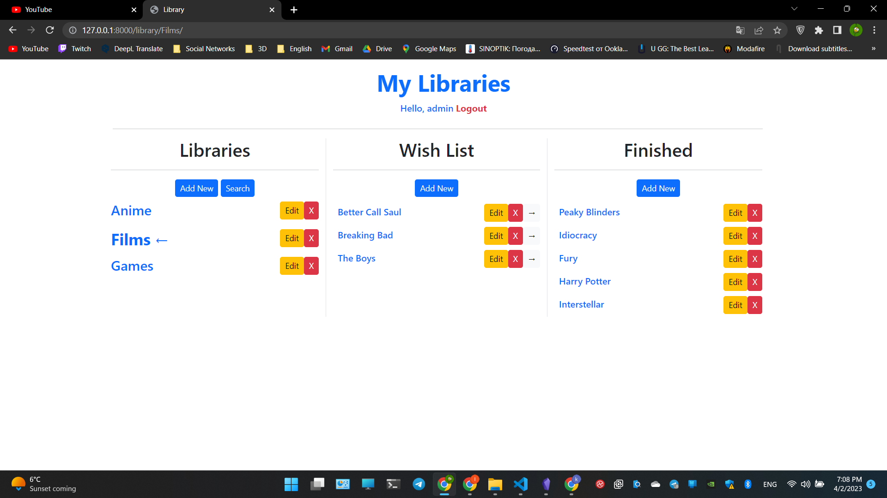

# Library - django site with bootstrap

Hi, this is my first fully-functional django project with bootstrap.



## Table of contents
* [General info](#general-info)
* [Features](#features)
* [Technologies](#technologies)
* [Running the project](#running-the-project)

## General Info

It's a training project that i've made at the beginning my way becoming a django developer using class based views. In this particular project i've learned what are class based views in Django. When you sign up, you can create any topics here, for example 'Books', and save there books that you wanna read in the future or books that you've already read.

## Features

- Anyone can create his own account
- Create any libraries you want
- Save your content in wish list to not forget
- Move it to 'Finished' column by pressing 1 button
- Update and delete whatever you want
- Search

## Technologies

- Python 3.10.6
- Django 4.1.7
- Bootstrap 4
- HTML5
- CSS3

## Running the project

There already is 1 created account, so if you want to check it out without registration:
login: admin
password: adminadmin

At first, you should have installed Python on your computer. Not necessary, but advised to create a virtual environment, so you store your projects dependecies apart for avoiding conflicts beetwen packages.
```shell
pip install virtualenv
```
Clone this repository and open it in any text editor. To create virtualenv, run the command below in a Windows terminal:
```shell
python -m venv venv
```
or if you're on Linux or Mac:
```shell
virtualenv env
```
To activate virtualenv, run
```shell
venv\Scripts\activate.bat
```
Linux or Mac
```shell
source env/bin/active
```
Than install project dependencies
```shell
pip install -r requirements.txt
```
Now you can run the project:
```shell
python manage.py runserver
```
